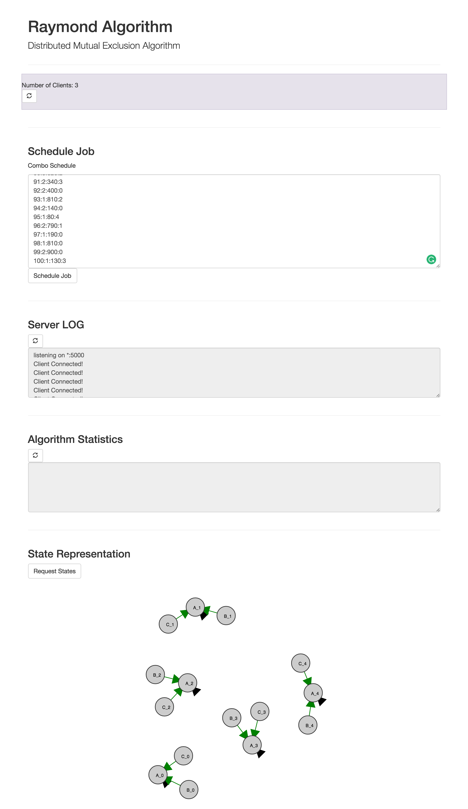
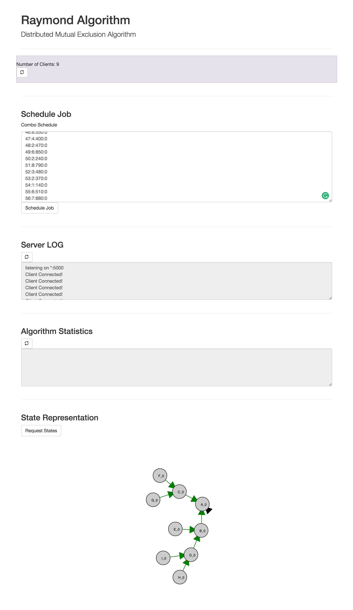

# Raymond
Raymond's Algorithm is a lock based algorithm for mutual exclusion on a distributed system.

# Notes
This was a part of C40534 assigments.

# Screenshots

## 3 Clients, 5 Resources

## 9 Clients, 1 Resources

